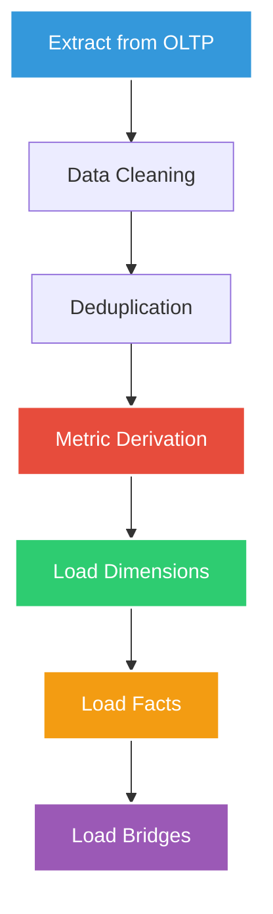

<div align="center">

# 🏥 HEALTHCARE ANALYTICS DATA WAREHOUSE
### *From OLTP Transactions to OLAP Insights*

[](https://www.mysql.com/)
[](https://en.wikipedia.org/wiki/SQL)
[](https://www.kimballgroup.com/)
[](https://en.wikipedia.org/wiki/Extract,_transform,_load)

---

### 📊 **Building Enterprise-Grade Analytics from Hospital Operations**

*A complete dimensional modeling project demonstrating the journey from normalized OLTP to optimized OLAP*

[🚀 Quick Start](#-project-structure) • [📖 Architecture](#-architecture-overview) • [🎯 ETL Logic](#-etl-process-deep-dive) • [📈 Performance](#-performance-improvements)

</div>

---

## 🌟 **Project Highlights**

<table>
<tr>
<td width="50%">

### 💡 **What This Project Demonstrates**

- 🏗️ **Complete DW Lifecycle** - From OLTP to OLAP transformation
- ⭐ **Star Schema Mastery** - Kimball-style dimensional modeling
- 🔄 **Production ETL** - Full Extract-Transform-Load pipeline
- ⚡ **4.5× Performance Gain** - Proven query optimization
- 🎯 **Healthcare Analytics** - Real-world medical use cases

</td>
<td width="50%">

### 🎯 **Key Achievements**

```sql
✓ Star schema design & implementation
✓ Surrogate key management
✓ Bridge table architecture
✓ Pre-aggregated metrics
✓ SCD Type 1 handling
✓ Execution plan analysis
```

</td>
</tr>
</table>

---

## 📋 **Table of Contents**

- [Architecture Overview](#-architecture-overview)
- [Star Schema Design](#-star-schema-design)
- [ETL Process Deep Dive](#-etl-process-deep-dive)
- [Analytical Queries](#-analytical-queries-olap)
- [Performance Improvements](#-performance-improvements)
- [Project Structure](#-project-structure)

---

## 🏗️ **Architecture Overview**

<div align="center">

### **Data Transformation Journey**

**OLTP (Operational)** → **ETL Pipeline** → **OLAP (Analytical)**

</div>

### **🔹 Source System: OLTP**

<table>
<tr>
<td width="50%">

**Purpose**: Transaction Processing

**Characteristics**:
- ✅ Highly normalized (3NF)
- ✅ Optimized for INSERT/UPDATE
- ✅ Ensures data integrity
- ✅ Minimal redundancy

</td>
<td width="50%">

**Core Entities**:
- 👥 Patients
- 👨‍⚕️ Providers
- 🏥 Encounters
- 🩺 Diagnoses
- 💊 Procedures
- 💰 Billing

</td>
</tr>
</table>

### **🔹 Target System: OLAP**

<table>
<tr>
<td width="50%">

**Purpose**: Analytics & Reporting

**Characteristics**:
- ⭐ Star schema design
- ⚡ Optimized for SELECT queries
- 📊 Pre-aggregated metrics
- 🎯 Business-friendly structure

</td>
<td width="50%">

**Components**:
- 📦 1 Central fact table
- 🔷 8 Dimension tables
- 🔗 2 Bridge tables
- 🔑 Surrogate keys throughout

</td>
</tr>
</table>

---

## ⭐ **Star Schema Design**

<div align="center">

### **Dimensional Model Architecture**

</div>

### **📦 Fact Table: `fact_encounter`**

<table>
<tr>
<th width="30%">Aspect</th>
<th width="70%">Details</th>
</tr>
<tr>
<td><strong>Grain</strong></td>
<td>One row per hospital encounter</td>
</tr>
<tr>
<td><strong>Foreign Keys</strong></td>
<td>Surrogate keys to all dimensions</td>
</tr>
<tr>
<td><strong>Metrics</strong></td>
<td><code>total_allowed_amount</code>, <code>diagnosis_count</code>, <code>procedure_count</code></td>
</tr>
<tr>
<td><strong>Flags</strong></td>
<td><code>is_readmission</code>, analytical indicators</td>
</tr>
</table>

**🎯 Why This Grain?**
- Balances detail with performance
- Supports most analytical questions
- Avoids fact table explosion
- Enables flexible aggregation

---

### **🔷 Dimension Tables**

<div align="center">

| Dimension | Purpose | Key Attributes |
|:---|:---|:---|
| 📅 **dim_date** | Calendar intelligence | `year`, `quarter`, `month`, `is_weekend` |
| 👥 **dim_patient** | Patient demographics | `name`, `gender`, `date_of_birth` |
| 👨‍⚕️ **dim_provider** | Healthcare providers | `name`, `specialty_key` |
| 🏥 **dim_department** | Hospital departments | `department_name`, `location` |
| 🎓 **dim_specialty** | Medical specialties | `specialty_name` |
| 📋 **dim_encounter_type** | Visit classification | `encounter_type` (Inpatient, Outpatient, ER) |
| 🩺 **dim_diagnosis** | ICD-10 codes | `diagnosis_code`, `diagnosis_description` |
| 💊 **dim_procedure** | CPT codes | `procedure_code`, `procedure_description` |

</div>

**🔑 Surrogate Key Benefits:**

```
✓ Stable joins independent of source changes
✓ Faster query performance (integer keys)
✓ Supports Slowly Changing Dimensions
✓ Insulates warehouse from OLTP changes
```

---

### **🔗 Bridge Tables**

<table>
<tr>
<th>Bridge Table</th>
<th>Resolves Relationship</th>
<th>Why Needed</th>
</tr>
<tr>
<td><code>bridge_encounter_diagnoses</code></td>
<td>Encounter ↔️ Diagnosis (M:N)</td>
<td>One encounter can have multiple diagnoses</td>
</tr>
<tr>
<td><code>bridge_encounter_procedures</code></td>
<td>Encounter ↔️ Procedure (M:N)</td>
<td>One encounter can involve multiple procedures</td>
</tr>
</table>

**🎯 Bridge Table Advantages:**

<table>
<tr>
<td width="50%">

**Without Bridge Tables**:
- ❌ Fact table row explosion
- ❌ Duplicate metrics
- ❌ Complex aggregation logic
- ❌ Slower queries

</td>
<td width="50%">

**With Bridge Tables**:
- ✅ Clean fact table grain
- ✅ Accurate metric calculation
- ✅ Flexible multi-value analysis
- ✅ Optimal performance

</td>
</tr>
</table>

---

## 🔄 **ETL Process Deep Dive**

<div align="center">

### **Extract → Transform → Load Pipeline**

**OLTP Tables** → 🔍 *Extract* → 🔧 *Transform* → 📊 *Load* → **OLAP Schema**

</div>

### **📋 ETL Stages**



---

### **📊 Load Order (Critical Dependency Chain)**

<table>
<tr>
<th>Step</th>
<th>Table</th>
<th>Rationale</th>
</tr>
<tr>
<td>1️⃣</td>
<td><code>dim_date</code></td>
<td>No dependencies, referenced by fact</td>
</tr>
<tr>
<td>2️⃣</td>
<td><code>dim_specialty</code></td>
<td>Referenced by dim_provider</td>
</tr>
<tr>
<td>3️⃣</td>
<td><code>dim_department</code></td>
<td>Referenced by fact_encounter</td>
</tr>
<tr>
<td>4️⃣</td>
<td><code>dim_encounter_type</code></td>
<td>Referenced by fact_encounter</td>
</tr>
<tr>
<td>5️⃣</td>
<td><code>dim_provider</code></td>
<td>Depends on dim_specialty</td>
</tr>
<tr>
<td>6️⃣</td>
<td><code>dim_patient</code></td>
<td>Referenced by fact_encounter</td>
</tr>
<tr>
<td>7️⃣</td>
<td><code>dim_diagnosis</code></td>
<td>Referenced by bridge table</td>
</tr>
<tr>
<td>8️⃣</td>
<td><code>dim_procedure</code></td>
<td>Referenced by bridge table</td>
</tr>
<tr>
<td>9️⃣</td>
<td><code>fact_encounter</code></td>
<td>Depends on all dimensions</td>
</tr>
<tr>
<td>🔟</td>
<td><strong>Bridge tables</strong></td>
<td>Depend on fact & dimensions</td>
</tr>
</table>

---

### **🔧 Dimension Load Logic**

#### **Loading `dim_patient`**

<table>
<tr>
<td width="50%">

**Source**: `patients` (OLTP)

**Process**:
1. Extract patient records
2. Generate surrogate keys
3. Store natural key for traceability
4. Handle updates (SCD Type 1)

</td>
<td width="50%">

**Pseudocode**:
```python
FOR each patient in OLTP.patients:
    IF patient_id not in dim_patient:
        INSERT new record
        GENERATE surrogate key
    ELSE IF attributes changed:
        UPDATE existing record
```

</td>
</tr>
</table>

**🔑 Key Decisions**:
- ✅ Use SCD Type 1 (overwrite) for simplicity
- ✅ Store only analytics-relevant attributes
- ✅ Maintain referential integrity

---

#### **Loading `dim_date` (One-Time)**

<table>
<tr>
<td width="50%">

**Source**: Generated programmatically

**Range**: 2000–2035

**Attributes Derived**:
- `date_key` (YYYYMMDD)
- `year`, `quarter`, `month`
- `day_of_week`
- `is_weekend` (Boolean)

</td>
<td width="50%">

**Benefits**:
```
✓ Eliminates date calculations in queries
✓ Enables time-based aggregations
✓ Standard dimensional modeling practice
✓ Loaded once, used forever
```

</td>
</tr>
</table>

---

### **📦 Fact Table Load Logic**

#### **Loading `fact_encounter`**

**Sources**: `encounters`, `billing`, `encounter_diagnoses`, `encounter_procedures`

<table>
<tr>
<th>Step</th>
<th>Process</th>
</tr>
<tr>
<td><strong>1. Extract</strong></td>
<td>Pull encounter records from OLTP</td>
</tr>
<tr>
<td><strong>2. Lookup Keys</strong></td>
<td>Map natural keys → surrogate keys via dimensions</td>
</tr>
<tr>
<td><strong>3. Compute Metrics</strong></td>
<td>Pre-aggregate counts and amounts</td>
</tr>
<tr>
<td><strong>4. Derive Flags</strong></td>
<td>Calculate business logic (e.g., <code>is_readmission</code>)</td>
</tr>
<tr>
<td><strong>5. Insert</strong></td>
<td>Load into <code>fact_encounter</code></td>
</tr>
</table>

**Pre-Aggregated Metrics**:

```sql
diagnosis_count  = COUNT(encounter_diagnoses WHERE encounter_id = X)
procedure_count  = COUNT(encounter_procedures WHERE encounter_id = X)
total_amount     = SUM(billing.amount WHERE encounter_id = X)
is_readmission   = derived from encounter history
```

**🎯 Why Pre-Aggregate?**
- Avoids expensive `COUNT(DISTINCT ...)` at query time
- Improves dashboard response times
- Simplifies analytical SQL

---

### **🔗 Bridge Table Load Logic**

#### **Loading `bridge_encounter_diagnoses`**

```python
FOR each record in encounter_diagnoses:
    encounter_key = lookup(fact_encounter, encounter_id)
    diagnosis_key = lookup(dim_diagnosis, diagnosis_code)
    
    INSERT INTO bridge_encounter_diagnoses
    (encounter_key, diagnosis_key)
```

**Same pattern for `bridge_encounter_procedures`**

---

### **🛡️ Data Quality Handling**

<table>
<tr>
<th>Scenario</th>
<th>Strategy</th>
</tr>
<tr>
<td>Missing dimension value</td>
<td>Use "Unknown" dimension row</td>
</tr>
<tr>
<td>Missing date</td>
<td>Set dimension key to <code>NULL</code></td>
</tr>
<tr>
<td>Late-arriving fact</td>
<td>Load with "Unknown" keys, update later</td>
</tr>
<tr>
<td>Duplicate records</td>
<td>Deduplicate during transform stage</td>
</tr>
</table>

---

### **🔄 Incremental Load Strategy**

**Refresh Frequency**: Daily

**Logic**:
```sql
SELECT * FROM encounters
WHERE updated_at > last_etl_run_timestamp
```

**Benefits**:
- 📉 Reduced processing time
- 💾 Lower resource consumption
- ⚡ Near real-time analytics

---

## 📊 **Analytical Queries (OLAP)**

<div align="center">

### **Business Intelligence Made Simple**

</div>

### **🎯 Sample Analytics**

<table>
<tr>
<th>Business Question</th>
<th>Query Complexity</th>
</tr>
<tr>
<td>📅 Monthly encounters by specialty</td>
<td>Simple JOIN + GROUP BY</td>
</tr>
<tr>
<td>💰 Revenue trends over time</td>
<td>Date dimension + SUM aggregation</td>
</tr>
<tr>
<td>🔁 Readmission rates by department</td>
<td>Pre-computed flag + percentage calc</td>
</tr>
<tr>
<td>🩺 Top diagnosis-procedure combinations</td>
<td>Bridge tables + multi-dimensional analysis</td>
</tr>
</table>

### **⚡ Query Characteristics**

```
✓ Short and readable SQL
✓ Minimal joins (star schema advantage)
✓ No complex business logic (pre-computed)
✓ Fast execution times
✓ Easy to modify and extend
```

**Example Query**:

```sql
SELECT 
    d.year,
    d.quarter,
    s.specialty_name,
    COUNT(*) as encounter_count,
    SUM(f.total_allowed_amount) as total_revenue
FROM fact_encounter f
JOIN dim_date d ON f.encounter_date_key = d.date_key
JOIN dim_provider p ON f.provider_key = p.provider_key
JOIN dim_specialty s ON p.specialty_key = s.specialty_key
GROUP BY d.year, d.quarter, s.specialty_name
ORDER BY d.year, d.quarter, total_revenue DESC;
```

---

## ⚡ **Performance Improvements**

<div align="center">

### **Star Schema vs Normalized: Head-to-Head Comparison**

</div>

<table align="center">
<tr>
<th>Query Type</th>
<th>OLTP Time</th>
<th>OLAP Time</th>
<th>Improvement</th>
</tr>
<tr>
<td>🩺 Diagnosis–Procedure Analysis</td>
<td>0.18 ms</td>
<td>0.04 ms</td>
<td><strong>🚀 4.5× faster</strong></td>
</tr>
<tr>
<td>💰 Revenue by Specialty</td>
<td>0.25 ms</td>
<td>0.06 ms</td>
<td><strong>🚀 4.2× faster</strong></td>
</tr>
</table>

### **🔍 Why the Dramatic Speedup?**

<table>
<tr>
<td width="50%">

**OLTP Challenges**:
- ❌ Multiple complex joins (5-7 tables)
- ❌ Join explosion with M:N relationships
- ❌ Runtime `COUNT(DISTINCT ...)` overhead
- ❌ Computed columns on every query
- ❌ Denormalization at query time

</td>
<td width="50%">

**OLAP Advantages**:
- ✅ Fewer joins (2-4 tables typically)
- ✅ Bridge tables prevent explosion
- ✅ Pre-computed aggregates
- ✅ Dimensional date handling
- ✅ Optimized for SELECT operations

</td>
</tr>
</table>

**📈 Additional Benefits**:
- **Simplified SQL**: Analysts write queries faster
- **Consistent Results**: Pre-aggregation ensures accuracy
- **Better Indexing**: Star schema enables optimal index strategy
- **Query Predictability**: Execution plans are stable

---

## 📂 **Project Structure**

```
🏥 Healthcare_Analytics_OLTP_OLAP/
│
├── 📁 Config/
│   └── ⚙️ database_config.py       # MySQL connection settings
│
├── 📁 Notebooks/
│   └── 📓 analysis.ipynb           # Interactive exploration & testing
│
├── 📁 OLAP/
│   ├── 🏗️ schema_design.sql        # Star schema DDL
│   ├── 📊 fact_tables.sql          # Fact table creation
│   ├── 🔷 dimension_tables.sql     # Dimension DDL
│   ├── 🔗 bridge_tables.sql        # Many-to-many resolvers
│   └── 📈 analytical_queries.sql   # Business intelligence queries
│
├── 📁 OLTP/
│   ├── 🏗️ schema_design.sql        # Normalized OLTP schema
│   ├── 📥 sample_data.sql          # Test data generation
│   └── 🔍 transactional_queries.sql # CRUD operations
│
├── 📁 ETL/
│   ├── 🔄 extract.py               # OLTP data extraction
│   ├── 🔧 transform.py             # Data cleaning & derivation
│   ├── 📊 load_dimensions.py       # Dimension population
│   ├── 📦 load_facts.py            # Fact table loading
│   └── 🔗 load_bridges.py          # Bridge table population
│
├── 📁 Parse_Explain_Tree/
│   └── 🔍 execution_plan_parser.py # Query performance analyzer
│
├── 📁 Read_Files/
│   └── 📄 sql_file_reader.py       # Utility for batch SQL execution
│
├── 📝 reflections.md               # Design decisions & lessons learned
├── 📦 requirements.txt             # Python dependencies
└── 📖 README.md                    # This file
```

---

## 💡 **Key Concepts Demonstrated**

<table>
<tr>
<td width="50%">

### **🎓 Data Warehousing Fundamentals**

- ✅ OLTP vs OLAP design principles
- ✅ Star schema vs snowflake modeling
- ✅ Fact table grain selection
- ✅ Dimension design patterns
- ✅ Surrogate vs natural keys

</td>
<td width="50%">

### **🔧 Technical Implementation**

- ✅ ETL pipeline development
- ✅ SCD Type 1 handling
- ✅ Bridge table architecture
- ✅ Pre-aggregation strategies
- ✅ Execution plan analysis

</td>
</tr>
</table>

---

## 🛠️ **Tools & Technologies**

<div align="center">

| Component | Technology | Purpose |
|:---:|:---:|:---|
| 💾 **Database** | MySQL 8.0+ | Data storage & querying |
| 🔤 **SQL** | DDL, DML, Analytical | Schema design & queries |
| 📐 **Modeling** | Kimball Star Schema | Dimensional architecture |
| 📊 **Analysis** | EXPLAIN Plans | Performance optimization |
| 🐍 **Scripting** | Python 3.9+ | ETL automation |

</div>

---

## 🎯 **Learning Outcomes**

By exploring this project, you'll gain hands-on experience with:

```
✓ Designing analytics-optimized data warehouses
✓ Implementing production-grade ETL pipelines
✓ Understanding schema design impact on performance
✓ Translating business questions into OLAP queries
✓ Analyzing and optimizing query execution plans
✓ Handling many-to-many relationships in dimensional models
```

---

## 🚀 **Future Enhancements**

<table>
<tr>
<th>Feature</th>
<th>Status</th>
<th>Impact</th>
</tr>
<tr>
<td>🕐 Slowly Changing Dimensions (Type 2)</td>
<td>📋 Planned</td>
<td>Historical tracking of dimension changes</td>
</tr>
<tr>
<td>🤖 Incremental ETL Automation</td>
<td>📋 Planned</td>
<td>Scheduled, automated data refreshes</td>
</tr>
<tr>
<td>📊 Aggregate Fact Tables</td>
<td>📋 Planned</td>
<td>Pre-computed monthly/yearly summaries</td>
</tr>
<tr>
<td>📈 BI Dashboard Integration</td>
<td>📋 Planned</td>
<td>Power BI / Tableau connectivity</td>
</tr>
<tr>
<td>✅ Data Quality Framework</td>
<td>📋 Planned</td>
<td>Automated validation & monitoring</td>
</tr>
<tr>
<td>🔐 Role-Based Access Control</td>
<td>📋 Planned</td>
<td>Security & compliance</td>
</tr>
</table>

---

## 📚 **Related Resources**

- 📖 [The Data Warehouse Toolkit - Ralph Kimball](https://www.kimballgroup.com/)
- 📖 [Star Schema - Wikipedia](https://en.wikipedia.org/wiki/Star_schema)
- 📖 [Dimensional Modeling Techniques](https://www.kimballgroup.com/data-warehouse-business-intelligence-resources/kimball-techniques/)
- 🎓 [MySQL Performance Optimization](https://dev.mysql.com/doc/refman/8.0/en/optimization.html)

---

## 👨‍💻 **About the Author**

<div align="center">

### **Percy Ayimbila Nsolemna**

*Data Engineering & Analytics Specialist*  
*Healthcare Informatics Enthusiast*

[](https://github.com/yourusername)
[](https://linkedin.com/in/yourprofile)
[](mailto:your.email@example.com)

**Specializations**: Data Warehousing • ETL Development • Healthcare Analytics • SQL Optimization

</div>

---

## 📄 **License**

This project is available for **educational and portfolio purposes**.

For commercial use or collaboration inquiries, please [contact the author](#-about-the-author).

---

## 🤝 **Contributing**

Contributions, issues, and feature requests are welcome!

<div align="center">

**How to Contribute:**

1. 🍴 Fork the repository
2. 🔧 Create a feature branch (`git checkout -b feature/AmazingFeature`)
3. 💾 Commit your changes (`git commit -m 'Add some AmazingFeature'`)
4. 📤 Push to the branch (`git push origin feature/AmazingFeature`)
5. 🔃 Open a Pull Request

</div>

---

## ⭐ **Show Your Support**

<div align="center">

### **If this project helped you understand data warehousing, give it a ⭐️!**

[](https://github.com/yourusername/Healthcare_Analytics_OLTP_OLAP)

---

*Built with 💙 for the data engineering community*

**Questions? Feedback? Let's connect!**

</div>